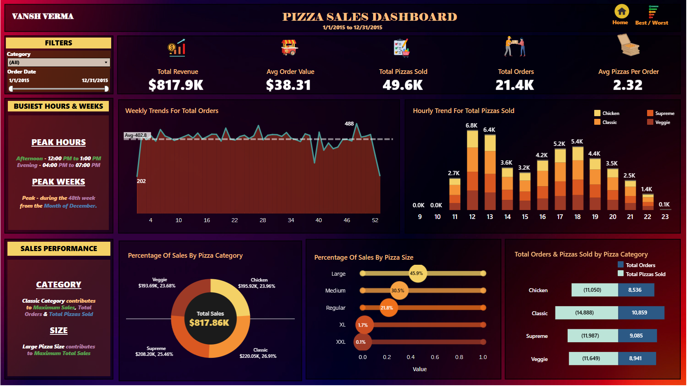

<h1 align="center">🍕 Pizza Sales Dashboard By Vansh Verma 📊</h1>

<p align="center">
  A complete SQL + Tableau  project to uncover insights from pizza sales data.<br>
  <strong>Technologies:</strong> MySQL • Tableau • Data Visualization
</p>

---

## 📁 Table of Contents
- [📌 Problem Statement](#-problem-statement)
- [📌 Project Objective](#-project-objective)
- [📊 KPI & Metrics](#-kpi--metrics)
- [📁 Data Cleaning](#-data-cleaning)
- [🧮 SQL Queries](#-sql-queries)
- [📈 Tableau Dashboards](#-tableau-dashboards)
- [🧠 Tools Used](#-tools-used)
- [📚 References](#-references)

---

## 🚀 Live Demo

🔍 **Click on the image below to explore the live demo of the Pizza Sales Dashboard:**

[](https://public.tableau.com/views/PlatoPizzaSalesDashboardProjectUM/HOME?:language=en-US&:sid=&:redirect=auth&:display_count=n&:origin=viz_share_link)

🔗 **Or directly visit the demo via this [🔗 link](https://public.tableau.com/views/PlatoPizzaSalesDashboardProjectUM/HOME?:language=en-US&:sid=&:redirect=auth&:display_count=n&:origin=viz_share_link)**.

✨ **Explore the interactive and insightful data visualizations now!**


---
## 📌 Problem Statement

### KPI’s REQUIREMENT

We need to analyze key indicators for our pizza sales data to gain insights into our business performance. Specifically, we want to calculate the following metrics:

- **Total Revenue**: The sum of the total price of all pizza orders.
- **Average Order Value**: The average amount spent per order, calculated by dividing the total revenue by the total number of orders.
- **Total Pizzas Sold**: The sum of the quantities of all pizzas sold.
- **Total Orders**: The total number of orders placed.
- **Average Pizzas Per Order**: The average number of pizzas sold per order, calculated by dividing the total number of pizzas sold by the total number of orders.

### CHARTS REQUIREMENT

We would like to visualize various aspects of our pizza sales data to gain insights and understand key trends. We have identified the following requirements for creating charts:

- **Hourly Trend for Total Pizzas Sold**: Create a stacked bar chart showing the hourly trend of total orders. Helps identify patterns/fluctuations in order volume.
- **Weekly Trend for Total Orders**: Line chart of weekly order trend throughout the year to spot peak weeks or high order periods.
- **% of Sales by Pizza Category**: Pie chart showing the distribution of sales across categories to analyze popularity.
- **% of Sales by Pizza Size**: Pie chart to reflect sales contribution by pizza size and customer preferences.
- **Total Pizzas Sold by Category**: Funnel chart to compare category-wise performance.
- **Top 5 Best Sellers**: Bar chart based on revenue, quantity, and order count to highlight most popular pizzas.
- **Bottom 5 Worst Sellers**: Bar chart based on revenue, quantity, and order count to identify underperforming pizzas.

---
## 📌 Project Objective

The aim is to analyze pizza sales to:
- Identify peak sales hours and days.
- Understand performance by pizza size and category.
- Find top-selling and underperforming pizzas.
- Generate visually rich reports using Tableau for business decision-making.

---

## 📊 KPI & Metrics

| Metric | Description |
|--------|-------------|
| **Total Revenue** | Total earnings from all sales |
| **Average Order Value** | Revenue ÷ Number of Orders |
| **Total Pizzas Sold** | Sum of all pizza quantities |
| **Total Orders** | Unique customer orders |
| **Avg Pizzas per Order** | Pizzas ÷ Orders |

---

## 📁 Data Cleaning

✔ Abbreviations of pizza sizes were converted for clarity in Tableau dashboard:  
`S → Small`, `M → Medium`, `L → Large`, `XL → Extra Large`, `XXL → Jumbo`.

```sql
SELECT pizza_size,
  CASE
    WHEN pizza_size = 'S' THEN 'Small'
    WHEN pizza_size = 'M' THEN 'Medium'
    WHEN pizza_size = 'L' THEN 'Large'
    WHEN pizza_size = 'XL' THEN 'Extra Large'
    WHEN pizza_size = 'XXL' THEN 'Jumbo'
  END AS full_size
FROM pizza_sales;
```

---

## 🧮 SQL Queries

Below are key SQL queries used to generate insights:

### 📌 Key Performance Indicators

```sql
-- Total Revenue
SELECT SUM(total_price) AS total_revenue FROM pizza_sales;

-- Average Order Value
SELECT SUM(total_price) / COUNT(DISTINCT order_id) AS avg_order_value FROM pizza_sales;

-- Total Pizzas Sold
SELECT SUM(quantity) AS total_pizza_sold FROM pizza_sales;

-- Total Orders
SELECT COUNT(DISTINCT order_id) AS total_orders FROM pizza_sales;

-- Average Pizzas Per Order
SELECT ROUND(SUM(quantity) / COUNT(DISTINCT order_id), 2) AS avg_pizza_per_order FROM pizza_sales;
```

### 📈 Trend Analysis

```sql
-- Hourly Sales Trend
SELECT HOUR(order_time) AS hour, SUM(quantity) AS pizzas_sold
FROM pizza_sales
GROUP BY hour ORDER BY hour;

-- Weekly Orders
SELECT WEEK(order_date, 3) AS week, COUNT(DISTINCT order_id) AS orders
FROM pizza_sales
GROUP BY week ORDER BY week;
```

### 🍕 Category & Size Analysis

```sql
-- % Sales by Category
SELECT pizza_category,
  ROUND(SUM(total_price) * 100 / (SELECT SUM(total_price) FROM pizza_sales), 2) AS pct
FROM pizza_sales GROUP BY pizza_category;

-- % Sales by Size
SELECT pizza_size,
  ROUND(SUM(total_price), 2) AS revenue
FROM pizza_sales GROUP BY pizza_size ORDER BY pizza_size;
```

### 🥇 Top & Bottom Pizzas

```sql
-- Top 5 by Revenue
SELECT pizza_name, SUM(total_price) AS revenue
FROM pizza_sales GROUP BY pizza_name ORDER BY revenue DESC LIMIT 5;

-- Bottom 5 by Orders
SELECT pizza_name, COUNT(DISTINCT order_id) AS orders
FROM pizza_sales GROUP BY pizza_name ORDER BY orders ASC LIMIT 5;
```

---

## 📈 Tableau Dashboards

Made using Tableau Public with real-time, drillable dashboards for sales trends, category breakdown, and top performers.

### 🧠 Key Insights


---

### 🗅 Dashboards

- 📍 **Home Dashboard**


- 📍 **Best & Worst Sellers**


---

## 🧠 Tools Used

| Tool | Purpose |
|------|---------|
| **MySQL Workbench** | Data analysis and querying |
| **Tableau** | Data visualization and dashboard creation |
| **Microsoft Excel** | Data formatting and pre-processing |
| **GitHub** | Version control & project hosting |

---

## 📚 References

- 🔗 [YouTube](https://www.youtube.com/watch?v=lrl0vz-p-yc&t=10s)
- 🔗 [Unified Mentor Interactive Lectures](https://www.unifiedmentor.com/)

---

> 🔁 *Feel free to fork, star, or suggest improvements! This project is built for practice, learning, and to showcase data storytelling skills.*
